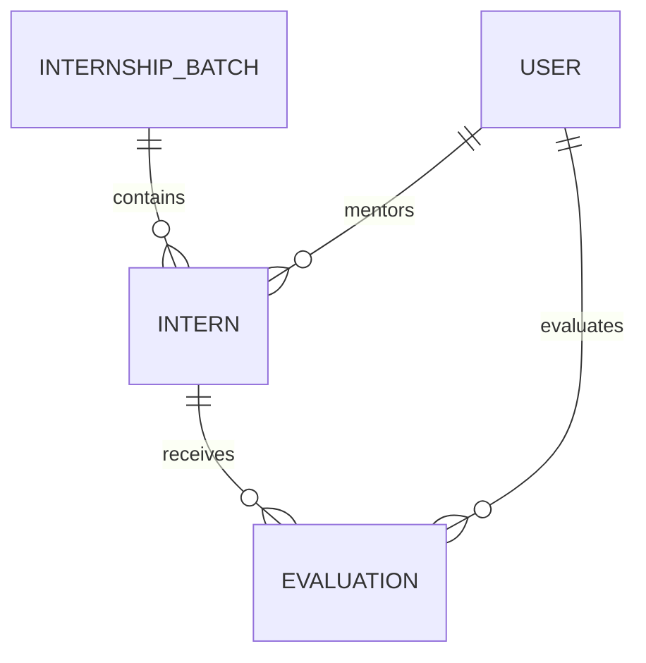

# 🚀 Dynamics 365 CE — Intern Management System

> **A hands-on CRM solution built on Microsoft Dynamics 365 Customer Engagement (On-Premises) to explore CRM data modeling, business processes, configuration, customization, security, automation, and Pre-Sales-oriented solution design.**

**Mohamed Rabea** · Pre-Sales Engineer Intern · Cubic Information Systems

---

## 📌 Overview

The **Intern Management System** is a CRM application designed to manage the complete internship lifecycle in one centralized platform.

Instead of handling applications, attendance, evaluations, mentor feedback, and hiring decisions across disconnected files and communication channels, the solution brings the process into a structured CRM environment.

### 🔄 Internship Lifecycle

```text
Application
     ↓
Selection
     ↓
Onboarding
     ↓
Training
     ↓
Evaluation
     ↓
Decision
```

The solution was built as a **hands-on learning project** while studying Microsoft Dynamics 365 Customer Engagement, with a strong focus on understanding how a business requirement can be translated into a CRM solution.

---

# 🎯 Why I Built This

When I started my Pre-Sales internship, I had limited practical CRM experience.

Instead of learning Dynamics 365 only from documentation and courses, I decided to build a complete business scenario around it.

The objective was to understand how to:

* Translate business requirements into CRM capabilities
* Design entities, fields and relationships
* Build structured business processes
* Configure forms, views and dashboards
* Apply business rules and automation
* Understand security and auditing
* Distinguish configuration from customization and development
* Think about CRM solutions from a Pre-Sales perspective
* Transfer the same design patterns into BFSI use cases

---

# 🧩 Business Problem

Internship data can easily become fragmented across:

* 📄 Spreadsheets
* 📧 Emails
* 📝 Mentor feedback
* 📊 Evaluation sheets
* 📅 Attendance records
* 💬 Informal communication
* 🗣️ Verbal hiring decisions

### The result

```text
Scattered Information
        ↓
Inconsistent Processes
        ↓
Limited Visibility
        ↓
Difficult Reporting
        ↓
Weak Decision Traceability
```

### The CRM Approach

```text
                  ┌─────────────────────────┐
                  │   Intern Management     │
                  │         CRM             │
                  └────────────┬────────────┘
                               │
       ┌───────────────────────┼───────────────────────┐
       ↓                       ↓                       ↓
   Intern Data             Processes             Evaluations
       │                       │                       │
       ↓                       ↓                       ↓
   Mentors / Tasks      Lifecycle / BPF        Scores / Decisions
       │                       │                       │
       └───────────────────────┼───────────────────────┘
                               ↓
                       Centralized View
```

---

# 🏗️ Solution Architecture

The solution is structured around four main layers:

```text
┌──────────────────────────────────────────────┐
│                 USER EXPERIENCE              │
│      Forms · Views · Grids · Dashboards      │
├──────────────────────────────────────────────┤
│                BUSINESS PROCESS              │
│       BPF · Rules · Workflow concepts        │
├──────────────────────────────────────────────┤
│                     DATA                     │
│   Intern · Batch · Evaluation · Activities   │
├──────────────────────────────────────────────┤
│                  GOVERNANCE                  │
│ Security · Auditing · Ownership · Access    │
└──────────────────────────────────────────────┘
```

---

# 🗂️ Data Model

The core solution contains three main custom entities:

| Entity               | Purpose                                                            |
| -------------------- | ------------------------------------------------------------------ |
| **Intern**           | Stores the intern's personal, internship and lifecycle information |
| **Internship Batch** | Represents an internship intake / cohort                           |
| **Evaluation**       | Stores evaluation records and scoring criteria                     |

### Relationships



### Key Intern fields

```text
Intern ID
Name
Email
Track
Lifecycle Stage
Status
Mentor
Attendance %
Overall Score
Hiring Recommendation
Manager Approval Required
```

### Evaluation model

Each evaluation captures six criteria:

```text
Technical Skills
Communication
Teamwork
Learning Ability
Initiative
Professionalism
```

The overall score is derived from the individual criteria rather than being manually entered.

---

# 🔄 Business Process Flow

The main lifecycle is implemented as a **six-stage Business Process Flow**:

```text
┌────────────┐
│ Application│
└─────┬──────┘
      ↓
┌────────────┐
│ Selection  │
└─────┬──────┘
      ↓
┌────────────┐
│ Onboarding │
└─────┬──────┘
      ↓
┌────────────┐
│  Training  │
└─────┬──────┘
      ↓
┌────────────┐
│ Evaluation │
└─────┬──────┘
      ↓
┌────────────┐
│  Decision  │
└────────────┘
```

Each stage represents a defined part of the business lifecycle and provides a structured path for the users managing the process.

---

# ⚙️ Dynamics 365 CE Capabilities

The project was used to explore a broad range of Dynamics 365 CE capabilities.

### 🧱 Data Modeling

* Custom entities
* Fields
* Relationships
* Lookups
* Option Sets
* Ownership concepts

### 🖥️ User Experience

* Main Forms
* Tabs & Sections
* Subgrids
* Related Records
* Quick Create
* Quick View
* System Views
* Editable Grid
* Advanced Find

### 🔄 Business Process

* Business Process Flow
* Stage-based lifecycle
* Required process steps

### 🧠 Business Logic

* Business Rules
* Calculated Fields
* Rollup Fields
* Conditional behaviour

### ⚡ Automation

* Classic CRM Workflows
* Real-time workflow concepts
* Asynchronous workflow concepts
* Automated task creation
* Decision automation scenarios

### 🔐 Security

* Security Roles
* Record-level access
* Business Unit concepts
* Ownership
* Field-level security

### 🕵️ Governance

* Auditing
* Solution structure
* Publisher / prefix
* Managed vs Unmanaged solutions
* Development → Test → UAT → Production lifecycle

### 📊 Reporting

* System Views
* Charts
* Dashboards
* Drill-down analysis

---

# 🧠 Configuration vs Customization vs Development

One of the most important lessons from this project was understanding that **not every requirement should be solved with code**.

```text
          Business Requirement
                  │
                  ↓
          Can configuration
          satisfy it?
             /       \
           YES        NO
           ↓           ↓
    Configuration   Customization
                       │
                       ↓
                Still not enough?
                   /       \
                 YES        NO
                 ↓           ↓
            Development   Customize
```

### Practical mapping

| Requirement                 | Approach                  |
| --------------------------- | ------------------------- |
| Create a new view           | Configuration             |
| Add a dashboard             | Configuration             |
| Create a new entity         | Customization             |
| Add a field                 | Customization             |
| Create a BPF                | Customization             |
| Create a calculated field   | Customization             |
| Complex server-side logic   | Development               |
| External system integration | Development / Integration |

This way of thinking is especially important in **Pre-Sales**, because the implementation approach affects effort, cost, risk and maintainability.

---

# 📊 Solution Components

The solution can be described through a concrete component inventory:

| Component             | Count | Status       |
| --------------------- | ----: | ------------ |
| Custom Entities       |     3 | ✅ Configured |
| Relationships         |     4 | ✅ Configured |
| Main Forms            |     3 | ✅ Configured |
| System Views          |     3 | ✅ Configured |
| Business Process Flow |     1 | ✅ Configured |
| Option Sets           |     6 | ✅ Configured |
| Calculated Field      |     1 | 🧠 Designed  |
| Rollup Fields         |     2 | 🧠 Designed  |
| Business Rules        |     2 | 🧠 Designed  |
| Classic Workflows     |     2 | 🧠 Designed  |
| Charts                |     4 | 🧠 Designed  |
| Dashboard             |     1 | 🧠 Designed  |
| Security Roles        |     4 | 🧠 Designed  |

> **Important:** The repository distinguishes between capabilities configured in the environment and components designed as part of the target solution.

---

# 🖼️ Application Demonstration

## Dashboard

The target dashboard provides a high-level view of internship programme health.


---

## Intern Record

The intern record acts as the central view of an intern's lifecycle, information and related activity.


---

## Business Process Flow

The lifecycle is represented through a six-stage process.


---

## Evaluation

The evaluation model captures six structured criteria and supports consistent scoring.


---

## Internship Batch

Internship batches provide a structured way to organize and compare intakes.


---

## Views & Records

System views provide filtered, sortable operational lists for day-to-day work.


---

# 📽️ Project Presentation

The project is documented in a complete solution presentation covering:

```text
Business Requirement
        ↓
Solution Design
        ↓
Data Model
        ↓
Platform Components
        ↓
Business Process
        ↓
Application Walkthrough
        ↓
Delivery & Risks
        ↓
BFSI Transfer
```

📄 **[Open the Full Presentation](presentation/Intern-Management-CRM-Solution.pdf)**

---

# 🏦 BFSI Transferability

Although this is an internship management solution, the underlying CRM design patterns are transferable to banking and financial services.

| Intern Management | BFSI Equivalent                  |
| ----------------- | -------------------------------- |
| Intern            | Applicant / Customer             |
| Internship Batch  | Campaign / Programme             |
| Mentor            | Relationship Manager             |
| Evaluation        | KYC / Credit Assessment          |
| Decision          | Approval                         |
| Lifecycle BPF     | Origination / Onboarding Process |

### Example

```text
Intern Management
       │
       ├── Intern
       ├── Batch
       ├── Evaluation
       └── Decision
              │
              ↓
       Same CRM Pattern
              │
              ↓
      Banking Solution
              │
       ┌──────┼──────┐
       ↓      ↓      ↓
   Applicant  KYC   Approval
```

This same platform thinking can be applied to:

* Customer 360
* Digital Onboarding
* Complaint Management
* Service Request Management
* KYC Management
* Relationship Management
* Loan Origination Support
* Other regulated business processes

---

# 💡 What I Learned

The biggest outcome wasn't learning individual Dynamics 365 features.

It was learning how to approach a business problem as a solution.

```text
Business Problem
      ↓
Requirements
      ↓
Data Model
      ↓
Business Process
      ↓
User Experience
      ↓
Business Logic
      ↓
Security
      ↓
Integration
      ↓
Reporting
      ↓
Deployment
```

This became the mental model I use when thinking about Dynamics 365 CE from a **Pre-Sales and solution design perspective**.

---

# 🎓 Learning Journey

This project was part of a broader effort to deepen my understanding of:

* CRM fundamentals
* Microsoft Dynamics 365 Customer Engagement
* Dynamics 365 CE On-Premises
* CRM Sales
* CRM Marketing
* Customer Service concepts
* Configuration
* Customization
* Business Process Design
* CRM Security
* Automation
* Integration
* Solution Design
* BFSI use cases

I also created a separate **Dynamics 365 CE knowledge presentation** to organize and reinforce the concepts I studied.

📘 **[Dynamics 365 CE Knowledge Presentation](docs/Dynamics365-CE-Knowledge.pdf)**

---

# 🚀 Key Takeaway

> **Dynamics 365 CE is not just a CRM application.**
>
> It is a platform that can be shaped around business data, processes, rules, user experience, security and integrations.

For me, the biggest shift was moving from:

```text
"How does this Dynamics feature work?"
```

to:

```text
"What is the business problem,
and how should I solve it with Dynamics?"
```

That shift is what made the connection between **CRM, solution design and Pre-Sales** much clearer for me.

---

# 👨‍💻 About Me

**Mohamed Rabea**

Pre-Sales Engineer Intern
**Cubic Information Systems**

Interested in:

`Pre-Sales` · `CRM` · `Microsoft Dynamics 365` · `Solution Design` · `BFSI` · `Business Analysis`

---

# ⚠️ Disclaimer

This repository represents a **personal learning / proof-of-concept project** created to explore Microsoft Dynamics 365 Customer Engagement capabilities.

It is **not a production banking system** and does not contain confidential customer information, credentials, or proprietary customer data.

---

# 🔖 Topics

`dynamics365` `dynamics365-ce` `dynamics-crm` `microsoft-dynamics` `customer-engagement` `crm` `crm-development` `crm-consulting` `presales` `solution-design` `bfsi` `banking` `fintech` `microsoft` `on-premises`
